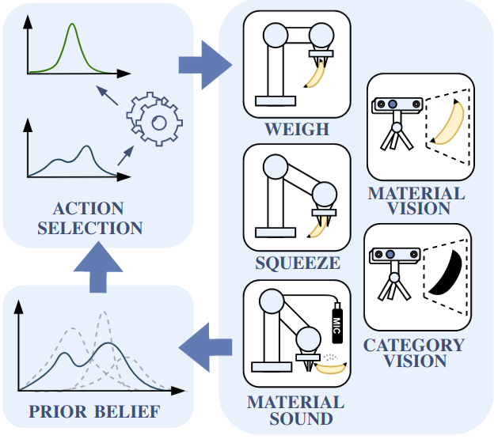
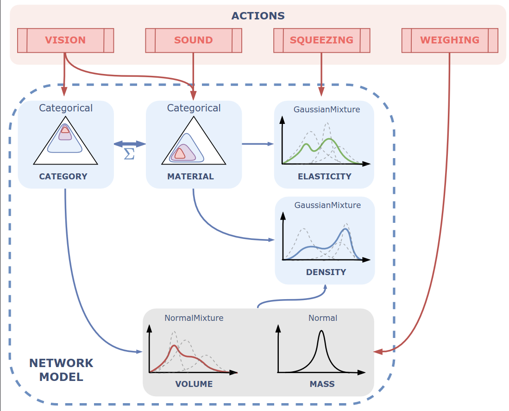

<p align="center">
  
</p>

# ACTSEL source code repository
We introduce ACTSEL. A method for automatic selection of actions that help optimally determine physical object properties that are not readily available through vision.

## Graphical model overview
<p align="center">
  
  
</p>
<p align="center">
  <em>General overview of the algorithm (left), Bayesian network and action relations (right)</em>
</p>

## Running the model
> For best experience install conda environment as `numpy`, `scipy` and `scikit-learn` are needed for algorithm operation
  1) To run the model, fill in the templates for nodes, actions and their relevant confusion matrices in `configs/templates`. In order to update the actual config `.json` files, run the `scripts/templates_to_cfgs.py` from root directory as:
  ```
  python3 scripts/templates_to_cfgs.py
  ```

  2) Customize the `main.py` to meet your action and object requirements byt customizing `experiment_object_names` and action to node mapping.

### Implementation remarks
The algorithm and results presented in the paper were obtained offline on pre-measured dataset for broader statistical understanding. This fact is reflected in `main.py`.

